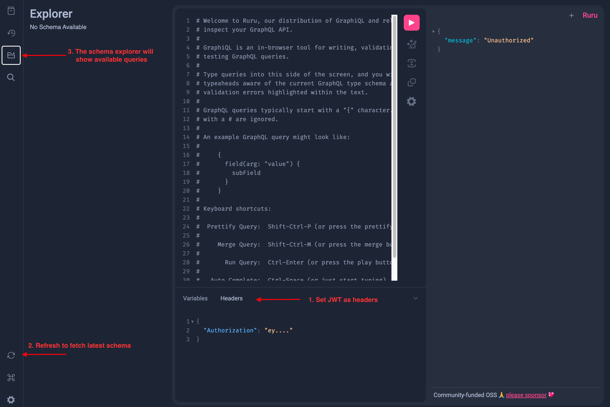

# Orcahouse API

This Terraform module deploys a PostGraphile server on AWS Lambda, accessible via the custom domain `mart.prod.umccr.org`. The server automatically introspects the configured PostgreSQL schema, as defined in the `main.tf` locals and variables.

The module exposes a `db_name` variable to specify the target database name for the Lambda function to connect to, using
the provided user credentials.

## GraphiQL

The GraphiQL endpoint is available at `/graphiql` (e.g., [`https://mart.prod.umccr.org/graphiql`](https://mart.prod.umccr.org/graphiql)).  
To use GraphiQL, you must set the Authorization header with your JWT token.

**How to set up GraphiQL authentication:**

1. Click the "Headers" tab or section.
2. Add the following JSON to set your Authorization header:

    ```json
    {
      "Authorization": "Bearer YOUR_JWT_TOKEN"
    }
    ```

    Replace `YOUR_JWT_TOKEN` with your actual token.

3. Hit the refresh button (double circular arrow) near the bottom left



## Deployment

Before deploying, ensure the Lambda server asset is built at `./lambda-server/dist/index.zip`. To build the Lambda asset:

```sh
cd lambda-server
pnpm install
pnpm build
```

Then, with your production AWS credentials configured, deploy using Terraform:

```sh
terraform init
terraform workspace select prod
terraform plan -var-file="orcavault.tfvars"
terraform apply -var-file="orcavault.tfvars"
```

## PostGraphile Lambda Server

This project deploys a GraphQL server using PostGraphile v5, which introspects a PostgreSQL schema and automatically generates a GraphQL endpoint.

While PostGraphile v5 is still in beta, it currently supports integration with Fastify v4 and is considered suitable for production use. In our case, the server is used in a read-only capacity, and API authentication is managed through an API Gateway authorizer.

### AWS Lambda Handler

The Lambda function expects the following environment variables:

- `DATABASE_NAME` – The name of the PostgreSQL database to connect to.
- `SECRET_ARN` – The ARN of the AWS Secrets Manager secret containing the database credentials.
- `GRAPHILE_ENV` – Specifies the environment stage (development or production).
